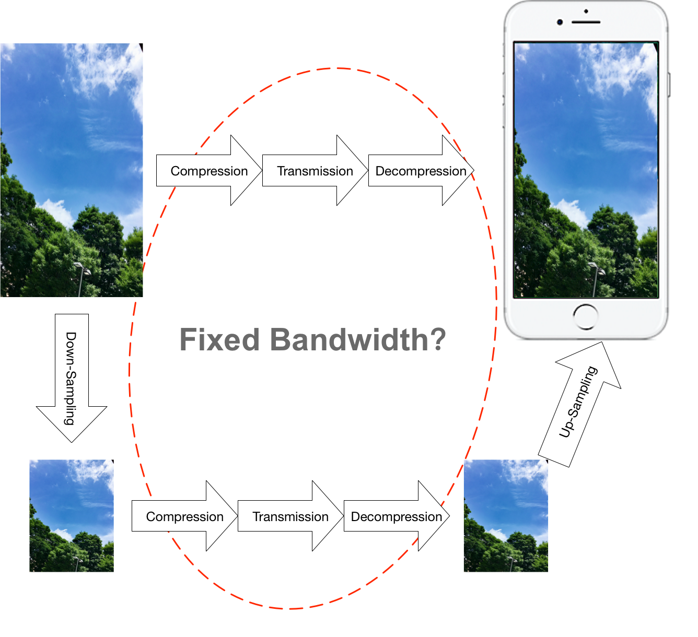

# 超解像技術の画像圧縮への応用

## まえがき

画像や映像コンテンツには膨大な情報量が存在する．しかも，その情報量は画像解像度の増加(Full HD/2K⇨4K⇨8K)とともに指数倍数で増えていく．近年，画像処理やコンピュータビジョン，人工知能分野で，高解像度画像コンテンツの需要が高まってきている．この情勢につれて，低解像度画像を高解像度画像に変換する超解像技術も注目されている．

この記事は，超解像技術を簡単に紹介し，その技術を画像圧縮への応用方法を議論する．

## 超解像技術の概要

単刀直入に言うと，「超解像」とは，画像の空間的解像度を上げるという意味である．例えば，Full HD解像度(1920×1080)から4K解像度(3840×2160)に拡張する．

### 超解像技術の需要性

コンテンツの視点から言うと，解像度を上げることで，ディテールをより鮮明に見えるとか，同じ精度条件下でより広い視野を映れるメリットがある．宇宙探索や精密医療画像などのアプローチはともかく，セキュリティ監視画像や画像理解の応用にも役に立てる．

技術進歩の立場からも，2018年現在，4K解像度はテレビやモニターのデフォルトスペックになり，ポータブル市場でも，4Kスクリーンを使用するスマートフォンや4K解像度をサポートするプロジェクターも売られている．更に，4Kに止まらず，コンシューマ向けの8Kテレビも上半期にリリースした[^8k]. それに対して，既存コンテンツはFull HDがデフォルトで4Kや8Kコンテンツがまだ少ない．つまり，**表示できる解像度が提供できる解像度より大きいという現実問題が存在する**．

コンテンツ視点からも，市場的需要の視点からも，既存低解像度画像を高解像度化にする需要が高いことがわかる．

### 超解像技術の分類

ネット上に公開したサーベイ論文[^survey]や関連記事[^sony] [^toshiba] [^fujitsu] [^mitsubishi]を読むと，超解像技術が多種多様に見えるが，根本的に二種類に分類できる．

1. 対象画像のみを参照する超解像技術，通称：Single image super-resolution，image interpolationとも呼ばれる
2. 対象画像以外に，ビッグデータや動画の場合に隣接フレームなども参考情報に取り入れ，超解像を行う技術，multi-frame super-resolutionと名付けられる．

理論的に，二者のうち，後者の方が参考情報が多くて，より良いクオリティの処理結果が得られるが，アルゴリズムの複雑さや高い計算コストという理由で製品開発に応用しにくい．

よって，本記事には，前者をターゲットにして紹介する．

### 超解像技術の理論的記述

この部分の記述はGoogleが2016年に発表した文献[^Google]を参考したもの．PS:その実現コードはGithub上にある．[^RAISRCode]

> Single Image Super Resolution (SISR) is the process of estimating a High-Resolution (HR) version of a Low-Resolution (LR) input image. This is a well-studied problem, which comes up in practice in many applications, such as zoom-in of still and text images, conversion of LR images/videos to high definition screens, and more. The linear degradation model of the SISR problem is formulated by 
>
> $$
> z = D_sHx
> $$
>

単一画像超解像技術は式(1)のような単純線形変換で表せる．低解像度画像$$z$$は求めたい高解像度画像$$x$$をblur演算子$$H$$でぼかした後，ダウンサンプリング演算子$$D_s$$で求められる．

ここでの考察は3つある．

1. ぼかし演算子$$H$$の必要性：低解像度画像からの変換過程を整理してみると，フィルターなしでアップサンプリング後，必然的に，エッジ部分が近傍補完のせいで隣接画素間の変化が穏やかになる．言い換えると，画像の周波数が低くなり，視覚的にぼけた画像に見える．ということで，ぼかし演算子$$H$$をダウンサンプリング演算子$$D_s$$から独立させたことこそ，処理プロセスがより明確になるわけ．

2. 実画像と理論モデルの差：式(1)で述べた超解像技術は線形計算に従う変化であるが，実際には，Raw画像以外に，圧縮したものを入力画像として使用する場合も十分考えられる．これも非線形構造の離散データである可能性が高い．更に，漫画の線画や会社logoのような構造不明(線形？非線形？領域ごと混合？)な状況も珍しくない．ここで，その差異をノイズとして導入し，次の式に化するべきではないかと思われる．

$$
   z = D_sHx+n
$$

ここで$$n$$はノイズを表す．

3. 式(2)からわかることは，複数の高解像度画像が同一の低解像度画像に対応している．つまり，低解像度画像から正解(真)の高画質画像を確定的に求めることが不可能である．よって結果の客観評価方式自体が一種の課題にもなる．(主観評価依存)

## 超解像技術と画像圧縮の関係性

今まで，超解像技術の概要を簡単に述べたが，実際に超解像技術を画像圧縮に使うとどうだろう？例えば，超解像で解像度を自由にいじれるのなら，低解像度画像で通信すれば十分ではないかと思われるだろう．つまり，下の図に示すように，画像を圧縮⇨伝送⇨展開を経て通信を行う上段過程に対して，下段には超解像を利用し，低解像度化と超解像を既存過程の両端に追加するアプローチを示している．

ここに考えられる超解像ルートのメリットは二つ（が，本質は一緒），

1. 既存ルートと同じ通信量でほぼ原画画質の低解像度画像を送信可能
2. 既存ルートと同じ圧縮率の低解像度画像を送信することで，$$1/k$$ まで通信情報量を削減

１の方は結果画質のみ比較を要するに対し，２の方では，通信量の削減率および結果画質の低下率両方のトレードオフを評価する必要がある．まして，どちらの方も，超解像で増えた計算コストの評価も行なうともっと良い．なお，画質評価について，超解像技術はあくまでも，欠損情報を推測する手法に過ぎない，客観評価指標として，PSNRを用いると不利な局面に落ちるだろう．代わりに，MS-SSIM[^msssim]や主観評価(MOS)を導入すると説得力があると考えられる．

よって実験設計は以下となる：

実験A：既存ルートと同じ通信量で低解像度画像を送信する実験

| 実験内容と条件               | パラメータ或いはメソット                                     | 注釈                                                         |
| ---------------------------- | ------------------------------------------------------------ | ------------------------------------------------------------ |
| 既存手法の前提実験           | 4つから5つの圧縮率で行う                                     | 各条件下の情報量($$R_{ref}$$)と結果画像($$I_{ref}$$)を記録   |
| 実験画像をダウンサンプリング | 単純間引き/平均値/重み付き平均値                             | メソットによる誤差は少ないが，単純間引きを優先的に実験し，余裕あれば多手法試行．処理時間は恐らく無視できる範疇だが，記録しておこう |
| 既存手法と同じ方式で圧縮     | $$R_{ref}$$に近づくように圧縮率を制限                        | 情報量$$R_{A}$$を記録                                        |
| 超解像                       | GoogleのRAISR[^Google] を始め，2つ以上の手法を試行．Bicubicでも追加 | 処理時間を記録                                               |
| 画質評価                     | MS-SSIM と主観評価                                           | 最後にRD曲線図を作成                                         |

---

[^8k]: (Sharp 8K) http://www.sharp.co.jp/aquos/sharp8k/ 
[^survey]: (サーベイ論文) https://link.springer.com/article/10.1007/s00138-014-0623-4 
[^sony]: (Sonyの紹介ページ) https://www.sony.jp/msc/enjoy/products/feature/20141106/ 
[^toshiba]: (Toshibaの紹介ページ) http://toshiba-mirai-kagakukan.jp/learn/sci_tech/tech_book/tec201310.htm
[^fujitsu]: (Fujitsuの紹介ページ) http://www.fmworld.net/product/phone/f-01j/display.html
[^mitsubishi]: (Mitsubishiの紹介ページ) http://www.mitsubishielectric.co.jp/corporate/randd/spotlight/spotlight16.html
[^Google]: (RAISR: Rapid and Accurate Image Super Resolution) https://www.arxiv-vanity.com/papers/1606.01299/
[^RAISRCode]: (A Python implementation of RAISR) https://github.com/movehand/raisr

[^msssim]: (Multiscale structural similarity for image quality assessment) https://ieeexplore.ieee.org/document/1292216/

[Back to Home](README.md)
