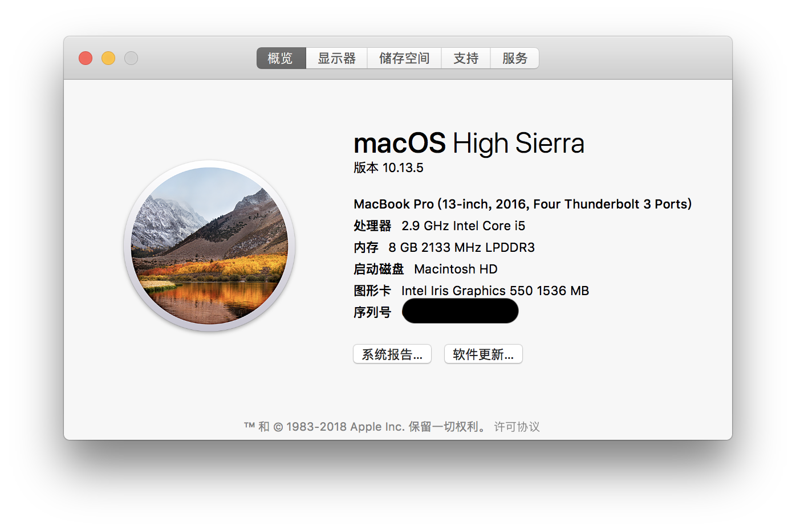
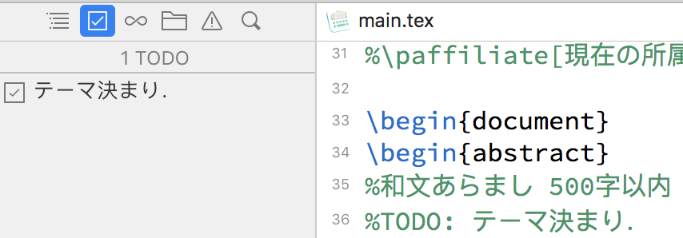
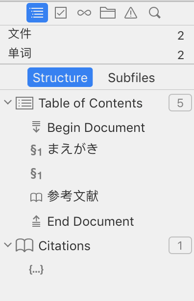
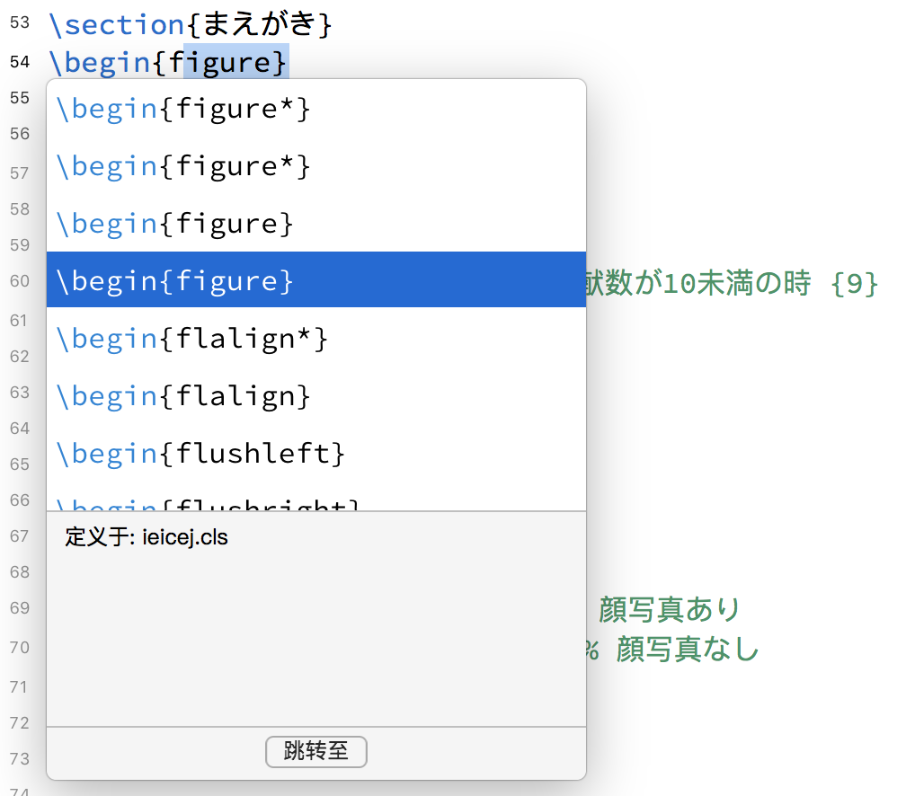

# MACOSでLATEXを使う

## まえがき

とある理由でWindowsユーザーからMacユーザーへ転身したので，MacOSで論文作成環境“LaTeX”の構築手順を記録する．(MS Officeに関しては，余りにも言うことが少なくて割愛する．)

## マシン環境



* Macbook pro (13-inch, 2016 Late with Touch Bar)
* CPU: 2.9 GHz Intel Core i5
* Memory: 8GB DDR3
* Graphic Chip: Intel Iris Graphics 550
* OS: macOS High Sierra(10.13.5)
* Main Language: Chinese (Mainland Simplified)

## APPの用意

[**MacTeX**](https://tug.org/mactex/)：MacTeXはTeXLiveをMac向けにパッケージ化したもの．

[**Texpad**](https://www.texpad.com/)：TexpadはGUI付きLaTeXエディターで，有料ではあるが，優れているもの．PS：Mac Storeで購入より，ホームページから購入する方が安い．


<iframe src="https://player.vimeo.com/video/231354048" width="640" height="388" frameborder="0" allowfullscreen></iframe>

## Texpadの設定

### 日本語設定

TexpadのタイプセッターをpLaTeXにする．タイプセッティングエンジンを「pLaTeX→dvipdfmx」に変更することで日本語LaTeX2eが通るようになる．

## Texpadのメリット

### TODOでメモる

``` latex
%TODO:こうやって，メモが書ける_φ(･_･
```



### サイドバーから目次を見える



ページ数が多くなるほど，この機能を欲しくなるだろう．

### コマンド自動補完



有る無しだけで世界が変わる．

### LaTeXマクロ

[ @exilias](https://qiita.com/exilias/items/70696e9e8dd65e4b7eb9)さんの記事から学んだもの，勉強になった．

> ``` latex
> \newcommand{\memo}[1]{\textcolor{red}{memo:#1}}
> \newcommand{\newsentence}[1]{\textcolor{blue}{#1}}
> \newcommand{\reduce}[1]{\textcolor{magenta}{#1}}
> ```
>
> `\memo{メモ内容}`は先生や共著者と相談したいことなどをよく書きます．また，`\newsentence{新しく追加した内容}`は新たに追加した文章をよくこれでマーキングして，先生にチェックしてもらう時の目印にしたりします．`\reduce{削るかもしれない内容}`は国際学会のフルペーパーはよく「USレターサイズで10ページまで」などと内容量の規定があったりするので，削り代はこのコマンドで括ったりすると便利です．そして，`\newcommand{\reduce}[1]{\textcolor{magenta}{#1}}`これを`\newcommand{\reduce}[1]{\textcolor{magenta}{}}`（#1を消す）にすることで，エディタ内の文章をわざわざコメントアウトすること無しに最終的なPDFから削除することができます．分量調整に便利です．

以上引用させていただいた．

## おわりに

その一，LaTeXで論文を書いて共著者にPDFと共に送ったら，向こうがWordユーザーの可能性が高い，この時には，[Pandoc](https://pandoc.org/)でできるだけWordに変換したこともしばしばある．

その二，LaTeXは論文作成に便利なツールであるが，正直に言うと，日常の文書作成やメモ，日記類には向かない．

Wordと比べると，事前の環境構築に時間コストが高い，文法の勉強コストも低くない，代わりに，Gitとかでのバージョン管理が簡単で，文字編集に集中しやすくてコンテンツの組版を無視できる楽しさがある．

その三，現代の高速ペース生活においては，Wordでも，LaTeXでも，「提供機能>>需要機能」で使いづらい．代わりに，近年流行ったMarkdownの方が使いやすい．Githubでこの記事を書く際に使うAppもTyporaというMarkdownのエディターである．

[Back to Home](README.md)